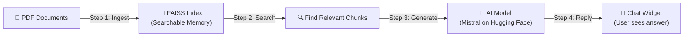
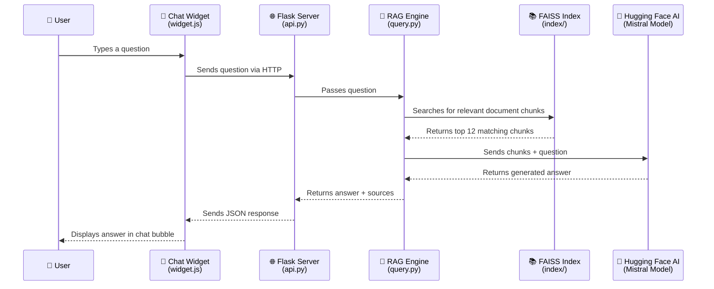

# 📖 BDU CIMS Chatbot — Project Documentation

> **Version:** `v0.1-beta` · **Last Updated:** March 1, 2026

---

## What Is This Project?

This is an **AI-powered chatbot for Bharathidasan University (BDU)**. It answers questions about the university — things like admission details, fee structures, available courses, contact information, and more.

Instead of reading through long PDF documents (like the university prospectus), a user can simply **type a question in plain English** and get a clear, concise answer back.

### How Does It Work? (The Simple Version)

Think of it like this:

1. 📄 **You feed it documents** — You give the system PDF files (like the BDU admissions prospectus).
2. 🧠 **It reads and "remembers" the content** — The system breaks the document into small chunks and stores them in a searchable format (like a super-smart index).
3. 💬 **A user asks a question** — Through a chat widget on a web page.
4. 🔍 **It finds the most relevant pieces** — It searches its memory for the parts of the document that best match the question.
5. ✍️ **An AI writes the answer** — It sends those relevant pieces to an AI model (Mistral, hosted by Hugging Face), which crafts a human-readable answer.
6. 📨 **The answer appears in the chat** — The user sees a nicely formatted response.

This technique is called **RAG (Retrieval-Augmented Generation)** — the AI doesn't guess; it always refers back to the actual documents you gave it.

---

## Project Overview Diagram

---

## 📁 What Each File & Folder Does

### Files (The Code)

| File | What It Does |
|---|---|
| **`ingest.py`** | The **"document reader"**. You run this once to load your PDF/Word/Text files, break them into small chunks, and save them as a searchable index. Think of it as the librarian who organizes books on shelves. |
| **`query.py`** | The **"brain"** of the chatbot. It takes a user's question, searches the index for relevant info, sends it to the AI model, and returns an answer. It can also be used directly from the command line (terminal) for testing. |
| **`api.py`** | The **"receptionist"**. It's a web server (using Flask) that sits between the chat widget and the brain. When the chat widget sends a question, this file receives it, passes it to `query.py`, and sends the answer back. |
| **`requirements.txt`** | A **shopping list** of all the software libraries this project needs to run. |
| **`.env`** | A **secret key file** that stores the Hugging Face API token — like a password that lets the system talk to the AI model. |
| **`.gitignore`** | A **"do not track" list** for version control. Tells Git which files to ignore. |
| **`README.md`** | The original **quick-start guide** for developers setting up the project. |

### Folders

| Folder | What It Contains |
|---|---|
| **`PDF/`** | The **source documents** you want the chatbot to know about. Currently contains the BDU admissions prospectus for 2025–2026. You can add more PDFs, Word docs, or text files here. |
| **`index/`** | The **searchable index** (generated by `ingest.py`). Contains two files that store the document chunks in a format optimized for fast searching. If you add new documents to `PDF/`, you re-run `ingest.py` to rebuild this. |
| **`frontend/`** | The **chat interface** that users see. Contains `index.html` (the web page) and `widget.js` (the chat bubble and messaging logic). |
| **`rag/`** | The **Python virtual environment** — a self-contained folder of installed libraries. Not project code; just the toolbox the project uses. |

---

## 🖥️ The Chat Widget (What Users See)

The frontend is a **floating chat bubble** (💬) that appears in the bottom-right corner of a web page. When you click it:

- A **chat window** opens with a greeting from "CIMS Assistant"
- **Quick-suggestion buttons** appear (e.g., "All Courses", "Fee Details", "Admission Process", "Contact")
- You can **type your own question** or click a suggestion
- While the AI is thinking, you see a **pulsing dots animation**
- The answer appears in a **chat bubble** with a source tag if it came from official BDU documents
- You can **expand** the chat window for a bigger view, or **minimize** it

---

## 🔄 How the Pieces Connect

---

## 🗝️ Key Technologies Used (In Plain Language)

| Technology | What It Is | Why It's Used |
|---|---|---|
| **Python** | A programming language | The main language all the backend code is written in |
| **Flask** | A lightweight web server framework | Powers the API that connects the chat widget to the AI |
| **FAISS** | A fast search library by Facebook/Meta | Quickly finds the most relevant document chunks for a question |
| **Hugging Face** | An AI platform | Hosts the AI model (Mistral) that generates answers |
| **Sentence Transformers** | An AI model for understanding text | Converts text into numerical "embeddings" so FAISS can search by meaning |
| **LangChain** | An AI orchestration toolkit | Helps load documents, split them into chunks, and manage the vector index |
| **HTML / JavaScript** | Web technologies | Powers the chat widget interface |

---

## 📝 How to Add New Documents

1. Place your new PDF, Word (`.docx`), or text (`.txt`) files in the **`PDF/`** folder
2. Run `python ingest.py` to rebuild the searchable index
3. Restart the server (`python api.py`) — the chatbot now knows about the new documents!

---

## 🚀 How to Start the Chatbot

1. Activate the virtual environment: `rag\Scripts\activate`
2. Run the server: `python api.py`
3. Open your browser to `http://localhost:5000`
4. Click the 💬 chat bubble and start asking questions!

---

> *This documentation is for the `v0.1-beta` release of BDU CIMS Chatbot.*
